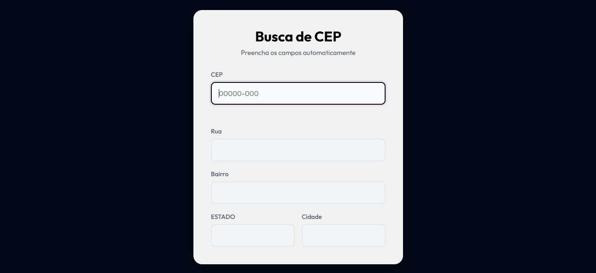
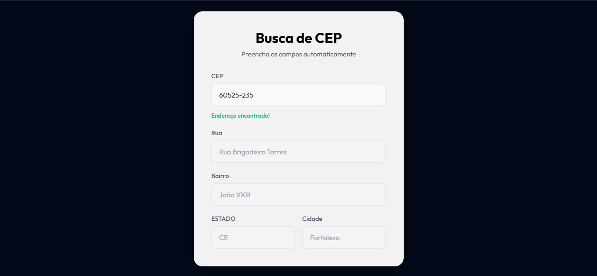
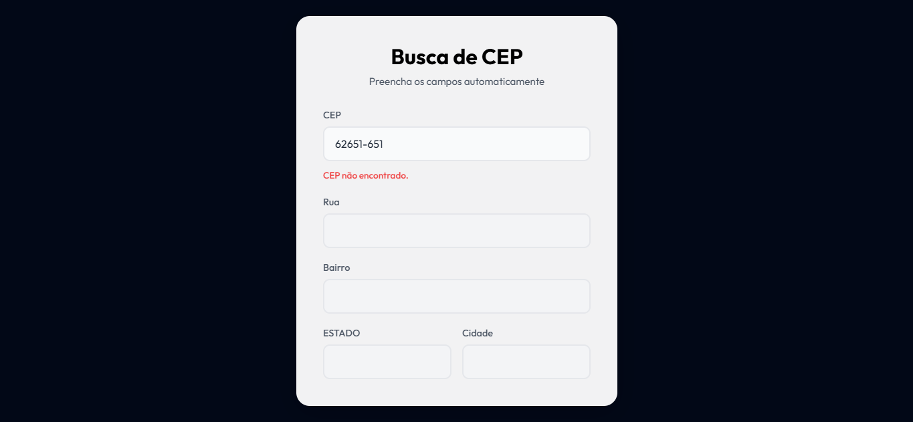

# 🔍 Busca de CEP com Fetch API

<div align="center">


Uma aplicação web responsiva para busca de CEP em tempo real, preenchendo automaticamente os campos de endereço utilizando a API ViaCEP.

</div>

---

## 📋 Descrição

Este projeto foi desenvolvido com o objetivo de criar uma ferramenta prática e eficiente para consulta de CEPs brasileiros. A aplicação utiliza a **Fetch API** para fazer requisições HTTP à **API ViaCEP**, trazendo informações automáticas de endereço como rua, bairro, cidade e estado.

A interface é intuitiva, responsiva e oferece feedback em tempo real ao usuário, com mensagens de validação e status da busca.

---

## ✨ Funcionalidades

- ✅ Busca de CEP em tempo real
- ✅ Preenchimento automático de campos de endereço
- ✅ Validação de CEP em formato correto
- ✅ Formatação automática do CEP (00000-000)
- ✅ Feedback visual com mensagens de status
- ✅ Design responsivo e moderno
- ✅ Interface acessível e amigável

---

## 📸 Preview

### Estado Inicial


### CEP Encontrado


### CEP Não Encontrado


---

## 🛠️ Tecnologias Utilizadas

- **HTML5** - Estrutura semântica
- **CSS3** - Estilização e responsividade
- **JavaScript (ES6+)** - Lógica da aplicação
- **Fetch API** - Requisições HTTP
- **ViaCEP API** - Base de dados de CEPs brasileiros

---

## 📋 Requisitos

Para utilizar este projeto, você precisa de:

- Um navegador web moderno (Chrome, Firefox, Safari, Edge)
- Conexão com a internet (para acessar a API ViaCEP)
- Conhecimento básico de HTML, CSS e JavaScript (para contribuir)

---

## 🚀 Como Usar

1. **Clone o repositório:**
   ```bash
   git clone https://github.com/seu-usuario/busca-cep-fetch-api.git
   ```

2. **Navegue até a pasta do projeto:**
   ```bash
   cd busca-cep-fetch-api
   ```

3. **Abra o arquivo `index.html` no navegador:**
   - Duplo clique no arquivo `index.html`, ou
   - Use uma extensão Live Server no VS Code, ou
   - Acesse através de um servidor local

4. **Digite um CEP válido:**
   - Insira um CEP de 8 dígitos no formato: `00000-000`
   - Os campos de endereço serão preenchidos automaticamente
   - Observe as mensagens de feedback em tempo real

---

## 📁 Estrutura do Projeto

```
busca-cep-fetch-api/
├── index.html          # Arquivo HTML principal
├── css/
│   └── style.css       # Estilos CSS
├── js/
│   └── script.js       # Lógica JavaScript
├── assets/
│   ├── inicial.png     # Screenshot - Estado inicial
│   ├── encontrado.png  # Screenshot - CEP encontrado
│   └── nao-encontrado.png  # Screenshot - CEP não encontrado
└── README.md           # Documentação
```

---

## 🎯 Como Funciona

1. **Input Listener**: O campo de CEP monitora a entrada do usuário
2. **Formatação**: Aplica máscara automática ao formato `00000-000`
3. **Validação**: Ao sair do campo, valida o CEP
4. **Requisição**: Faz uma requisição à API ViaCEP
5. **Resposta**: Preenche os campos automaticamente ou exibe mensagem de erro

---

## 🔗 API Utilizada

**ViaCEP** - API pública de CEPs brasileiros
- Endpoint: `https://viacep.com.br/ws/{CEP}/json/`
- Sem autenticação necessária
- Retorna: rua, bairro, cidade, estado

---

## 💡 Exemplos de CEPs para Testar

- `01310-100` - Avenida Paulista, São Paulo - SP
- `20040020` - Centro, Rio de Janeiro - RJ
- `30140071` - Centro, Belo Horizonte - MG

---

## 🐛 Tratamento de Erros

A aplicação trata os seguintes cenários:

- CEP inválido (menos de 8 dígitos)
- CEP não encontrado na base de dados
- Erros de conexão com a API
- Campos vazios

---

## 📝 Licença

Este projeto está sob a licença MIT. Veja o arquivo LICENSE para mais detalhes.

---

## 👨‍💻 Desenvolvedor

**Guilherme Queiroz (Guielihan)**

<div style="display: flex; gap: 10px; flex-wrap: wrap;">
  <a href="https://discord.com/users/1297971679737413632">
    
  </a>
  <a href="https://www.instagram.com/devguielihan/">
    
  </a>
  <a href="mailto:devguielihan@gmail.com">
    
  </a>
</div>

---

## 🎓 Agradecimentos e Referências

<div style="display: flex; gap: 10px; flex-wrap: wrap;">
  <a href="https://github.com/in100tiva">
    
  </a>
  <a href="https://godevs.in100tiva.com/">
    
  </a>
</div>

---

<p align="center">
  Feito com 💙 por Guielihan
</p>